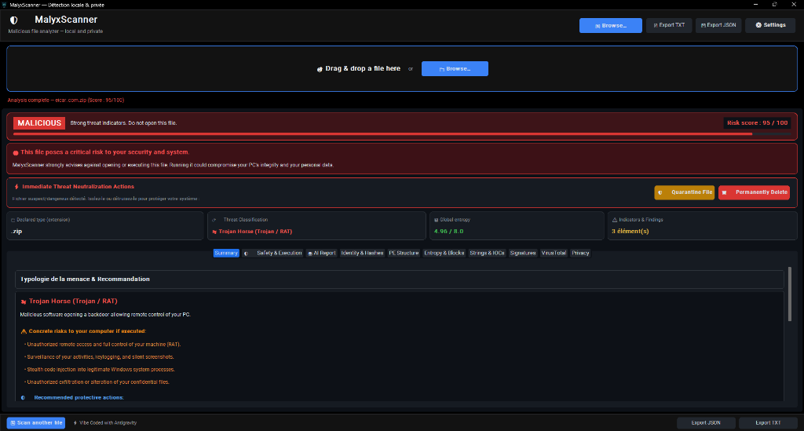
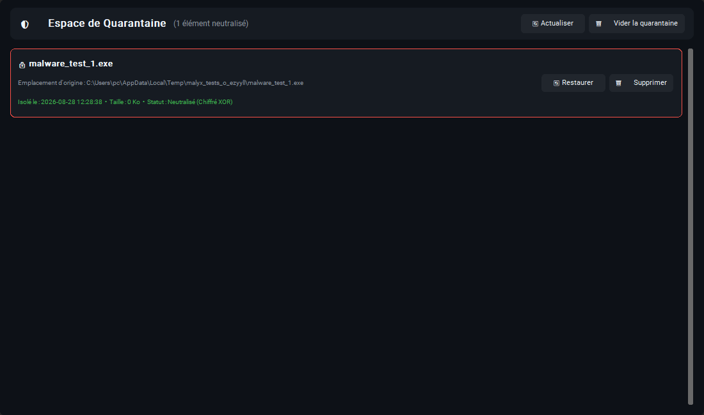
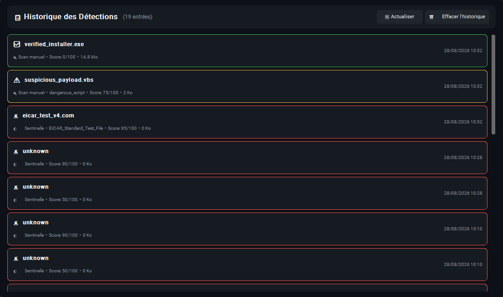
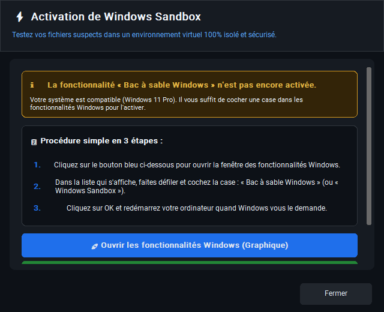
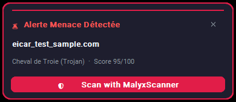

<p align="center">
  
</p>

<h1 align="center">MalyxScanner</h1>

<p align="center">
  <a href="LICENSE"></a>
  <a href="https://microsoft.com"></a>
  <a href="https://python.org"></a>
  <a href="https://github.com/maelmeriguet4-glitch/MalyxScanner/releases/tag/v3.0.0"></a>
  <a href="#privacy--data-handling-transparency"></a>
  <a href="#test-suite--validation"></a>
</p>

<p align="center">
  <b>A local malware triage and static analysis desktop utility for suspicious files on Windows.</b>
</p>

> [!IMPORTANT]
> **Role & Positioning**: MalyxScanner is a static analysis and incident triage tool designed to **complement, not replace**, traditional antivirus software or enterprise endpoint detection and response (EDR) solutions. It evaluates structural file properties without executing untrusted binaries.

---

## 📌 Overview

**MalyxScanner** is an open-source desktop triage tool that provides security analysts, incident responders, and power users with deep, structural inspection of suspicious files. It extracts PE headers, verifies Authenticode signatures, measures chunked Shannon entropy, flags Indicators of Compromise (IOCs), matches embedded YARA rules, and assists with 1-click Windows Sandbox isolation.

Traditional signature-based antivirus solutions often alert after execution or remove files silently. MalyxScanner gives operators full transparency over *why* a file is suspicious, providing structural evidence without running the payload.

---

## 📸 Screenshots & Live Previews

<p align="center">
  
  <br>
  <i><b>Figure 1</b>: Live malware detection dashboard with 1-Click Windows Sandbox launch, XOR Quarantine, and Secure File Shredding.</i>
</p>

<p align="center">
  
  &nbsp;
  
  <br>
  <i><b>Figure 2</b>: Dedicated Quarantine Vault with XOR payload neutralization (left) and persistent Detection History dashboard (right).</i>
</p>

<p align="center">
  
  &nbsp;
  
  <br>
  <i><b>Figure 3</b>: Windows Sandbox 1-Click interactive setup wizard (left) and non-intrusive Sentinel real-time toast alert (right).</i>
</p>

---

## 🎯 Threat Model & Scope

### What MalyxScanner is Designed For:
* **Local Triage of Suspicious Files**: Rapidly inspecting unverified downloads, attachments, or scripts.
* **Static Binary & Script Inspection**: Parsing PE headers, sections, imports, exports, and embedded commands.
* **Preliminary Incident Investigation**: Extracting network IOCs, registry persistence keys, and obfuscated strings.
* **Assisting Analysts with Structural Evidence**: Providing clear, interpretable indicators to make informed decisions.

### What MalyxScanner is NOT:
* **Not an Antivirus / EDR Replacement**: It does not replace real-time behavioral kernel drivers or enterprise EDR solutions.
* **No Safety Guarantees**: A file marked *Clean* is not guaranteed to be 100% safe (e.g., zero-day exploits or unmapped techniques).
* **No Malicious Certitude**: A file marked *Suspicious* is not necessarily malware (heuristics may trigger on legitimate packed code).
* **No Runtime Observation**: Static analysis cannot detect payloads injected dynamically into memory post-execution.
* **AI Output is Advisory**: AI-generated summaries are assistive and must not be treated as a definitive classification.

---

## ⚖️ Understanding the Risk Score & Evidence

The **Risk Score (0–100)** is a heuristic indicator designed to help prioritize files for further investigation. It is **not** a mathematical percentage probability of infection.

```text
Example Analysis Output:
─────────────────────────────────────────────────────────────
Verdict:    SUSPICIOUS
Risk Score: 72 / 100

Evidence:
  • YARA rule match: Suspicious_PowerShell_Dropper
  • High entropy observed in .rsrc section (7.82 / 8.0)
  • Unsigned executable (Authenticode certificate missing)
  • Suspicious administrative commands detected in strings
─────────────────────────────────────────────────────────────
```

### Risk Factors Evaluated:
1. **YARA Signatures**: Known malware families, ransomware notes, and common offensive tooling patterns.
2. **PE Anomalies**: Dangerous section permissions (e.g., `IMAGE_SCN_MEM_WRITE | IMAGE_SCN_MEM_EXECUTE`), TLS callbacks, timestamp discrepancies.
3. **Shannon Entropy (16 KB Chunks)**: Identifies packed, encrypted, or compressed payloads hiding within resource sections or overlays.
4. **MITRE ATT&CK Mapping**: Imported Windows APIs linked to process injection, privilege escalation, or persistence.
5. **IOC & String Patterns**: Extracted public IPv4 addresses, URLs, encoded PowerShell commands, and registry keys.

> **Principle**: No single indicator alone proves that a file is malicious. Results should always be interpreted alongside the underlying evidence.

---

## ⚠️ False Positives & Limitations

Heuristic engines can produce false positives. Legitimate software may trigger elevated risk scores if it contains:
* **Commercial or Open-Source Packers**: UPX, Themida, VMProtect, or PyInstaller wrappers.
* **Administrative Tools**: PowerShell scripts, IT management utilities, or remote access agents.
* **Game Modifications & Anti-Cheat**: Hooking libraries or obfuscated binaries.

If an unknown file is flagged as *Suspicious*, verify its digital signature, review the extracted strings, or test it inside the built-in **Windows Sandbox**.

---

## ⚙️ Technical Capabilities

### 1. Static PE & Binary Inspection
* **Authenticode Verification**: Validates WinTrust digital certificates and flags unsigned or self-signed executables.
* **Section Analysis & Anomaly Detection**: Detects writable+executable memory sections and unusual section names.
* **MITRE ATT&CK API Mapping**: Maps imported APIs against known adversary techniques (Token Impersonation, Process Hollowing, C2).
* **Forensic Metadata**: Extracts PDB debug paths, compilation timestamps, Subsystem, and `StringFileInfo`.

### 2. Shannon Entropy & Packer Detection
* **Global & Block-Level Entropy**: Calculates byte randomness across 16 KB chunks to pinpoint hidden payloads.
* **Packer Signatures**: Detects UPX, VMProtect, Themida, and custom packer compression structures.

### 3. Forensic IOC & Pattern Extraction
* **Network Indicators**: Extracts public IPv4 addresses, hostnames, and suspicious protocol URLs (`http://`, `https://`, `ftp://`).
* **System Footprints**: Detects persistence registry keys (`CurrentVersion\Run`, services) and commands (`powershell -enc`, `vssadmin delete shadows`).
* **Universal File Support**: Analyzes 12 distinct file families (Executables, Office documents, Archives, Scripts, PDF, System binaries, Source code, Game assets, Media).

### 4. Real-Time Sentinel Background Watcher
* **Passive Monitoring**: Monitors the Downloads directory using memory-bounded streaming without locking files or competing with host antivirus.
* **System Tray Persistence**: Stays active in the Windows notification area (`pystray`) when the main window is closed.
* **Minimalist Toast Alerts**: High-contrast, non-intrusive alerts positioned at the bottom-right of the screen.

### 5. 1-Click Windows Sandbox Integration
* **Dynamic VM Generation**: Generates ephemeral `.wsb` configuration profiles mounting the target folder in strict read-only mode (`<ReadOnly>true</ReadOnly>`).
* **Interactive Setup Wizard**: Built-in activation guide with automatic administrator (UAC) elevation handling.

### 6. Safe Quarantine Vault & Secure Deletion
* **Symmetric XOR Obfuscation**: Quarantined files are neutralized on disk (`%APPDATA%\MalyxScanner\quarantine`) with byte-level XOR scrambling to prevent accidental execution and host antivirus deletion.
* **Dedicated Management GUI**: Inspect metadata, restore files bit-for-bit, or execute file shredding.
* **Secure File Shredding**: Multi-pass data overwriting (`os.urandom` + zeros + `fsync`) before unlinking confirmed threats.

---

## 🔒 Privacy & Data Handling Transparency

MalyxScanner is built on an **offline-first** architecture. The core scanning engine, entropy calculators, YARA scanner, and quarantine vault execute 100% locally in memory.

| Feature | Execution Model | Data Sent to Internet? | Privacy Level |
| :--- | :--- | :--- | :--- |
| **Core Static Scanning** | 100% Local (In-memory streaming) | **None** | 🛡️ Maximum (100% Offline) |
| **YARA Rule Engine** | 100% Local (Embedded rules) | **None** | 🛡️ Maximum (100% Offline) |
| **Sentinel Background Watcher** | 100% Local (Streaming buffer) | **None** | 🛡️ Maximum (100% Offline) |
| **Windows Sandbox 1-Click** | 100% Local (Isolated Hyper-V container) | **None** | 🛡️ Maximum (100% Offline) |
| **Quarantine & File Shredding** | 100% Local (XOR scrambling + wipe) | **None** | 🛡️ Maximum (100% Offline) |
| **Credential Storage** | Windows DPAPI local encryption | **None** | 🛡️ Maximum (100% Offline) |
| **Local AI Analyst (Ollama)** | 100% Local (`http://localhost:11434`) | **None** | 🛡️ Maximum (100% Offline) |
| **Cloud AI Analyst (Optional)** | Encrypted HTTPS (Metadata text only) | **Textual summary only** | 🔒 High (File is never sent) |
| **VirusTotal Lookup (Optional)**| SHA-256 Hash query only | **SHA-256 hash only** | 🔒 High (File is never sent) |
| **Telemetry & Tracking** | None | **None** | 🛡️ Zero tracking / 100% Private |

> [!WARNING]
> **Confidential Files & External Services**: Do not submit file hashes or metadata to third-party services (VirusTotal, Cloud LLMs) if you are analyzing confidential, proprietary, personal, or classified files.

---

## 🤖 AI SOC Analyst Clarification

MalyxScanner includes an optional AI triage brief generator designed to assist with summarizing technical indicators:
* **100% Local Mode (Recommended - via [Ollama](https://ollama.com))**: Runs entirely on your local hardware using models such as `llama3.2`, `mistral`, or `qwen2.5`. Zero data leaves your computer.
* **Encrypted Cloud Mode (OpenRouter, Gemini, OpenAI, Claude)**: Sends only a textual metadata summary over an encrypted HTTPS connection (*the actual binary file is never transmitted*).
* **Disclaimer**: AI outputs are assistive interpretations and may occasionally contain inaccuracies. They should always be verified against the static evidence.

---

## 🗄️ Quarantine & Secure Deletion Specifics

### Quarantine Vault Mechanism
* Quarantined files are moved to `%APPDATA%\MalyxScanner\quarantine` and scrambled using a multi-byte XOR stream cipher.
* **Purpose**: This format prevents accidental double-click execution and prevents host antivirus engines from deleting files from the triage folder.
* **Note**: XOR obfuscation is designed for execution neutralization and is not equivalent to military-grade cryptographic protection.

### Secure File Deletion Nuance
* File overwriting is performed on a best-effort basis using multi-pass pseudo-random bytes (`os.urandom`), zero-byte overwriting, and `os.fsync`.
* **Hardware Note**: The effectiveness of software-based secure deletion may vary depending on flash storage controllers, wear-leveling algorithms on modern SSDs, and underlying filesystem semantics.

---

## 🛡️ Security & Responsible Use

* **Privilege Separation**: Avoid running MalyxScanner with elevated administrator privileges unless performing tasks that strictly require it.
* **System Hygiene**: Keep Windows updates and your primary antivirus / endpoint protection up to date.
* **Isolated Testing**: For high-risk binaries, always leverage the 1-click **Windows Sandbox** integration or an isolated, air-gapped virtual machine.
* **Vulnerability Reporting**: If you discover a security vulnerability in MalyxScanner, please report it privately via email to [maelmeriguet4@proton.me](mailto:maelmeriguet4@proton.me).

---

## 🧪 Test Suite & Validation

MalyxScanner includes an automated unit and integration test suite covering static parsers, entropy calculations, threat classifiers, Sentinel streaming, quarantine lifecycle, and Sandbox generation:

```powershell
# Run the complete test suite
python -m unittest discover -s tests
```

> **Testing Note**: The 58 automated tests validate internal parser accuracy, stability, and engine logic. They demonstrate software reliability but do not, by themselves, represent a universal benchmark against live, evolving zero-day malware.

---

## 🚀 Installation & Usage

### Prerequisites
* Windows 10 / 11 (64-bit)
* Python 3.11+

### Quick Start
```powershell
# Clone the repository
git clone https://github.com/maelmeriguet4-glitch/MalyxScanner.git
cd MalyxScanner

# Set up virtual environment
python -m venv .venv
.\.venv\Scripts\activate

# Install dependencies
pip install -r requirements.txt

# Run MalyxScanner
python src/main.py
```

### Compiling Standalone Executable
To build the standalone `.exe` using PyInstaller:
```powershell
pyinstaller --noconfirm MalyxScanner.spec
```
The compiled output is placed in `dist/MalyxScanner/MalyxScanner.exe`.

---

## 📁 Project Structure

```
MalyxScanner/
├── assets/                  # Application icons, logos, and preview screenshots
├── rules/                   # Embedded YARA detection rules
├── src/
│   ├── core/
│   │   ├── ai_analyst.py         # AI SOC brief generator
│   │   ├── analyzer.py           # Core static analysis orchestrator
│   │   ├── entropy.py            # Shannon entropy calculation engine
│   │   ├── filetype.py           # Magic bytes and MIME detection
│   │   ├── hashes.py             # MD5, SHA-1, SHA-256, SHA-512, Imphash
│   │   ├── history.py            # Persistent detection history engine
│   │   ├── pe_analysis.py        # Windows PE header & MITRE parser
│   │   ├── remediation.py        # Safe XOR quarantine and secure deletion
│   │   ├── risk_score.py         # Heuristic composite risk scoring
│   │   ├── sandbox.py            # Windows Sandbox 1-click generator & launcher
│   │   ├── sentinel.py           # Real-time background watcher daemon
│   │   ├── strings_extractor.py  # IOC and string extraction
│   │   ├── threat_classifier.py  # Threat family taxonomy
│   │   ├── virustotal.py         # Cloud hash reputation client
│   │   └── yara_scanner.py       # YARA rule scanning engine
│   ├── gui/
│   │   ├── app.py                # Main application window & top toolbar
│   │   ├── history_panel.py      # Detection history GUI panel
│   │   ├── quarantine_panel.py   # Quarantine management GUI panel
│   │   ├── result_view.py        # Multi-tab analysis dashboard
│   │   ├── sandbox_dialog.py     # Windows Sandbox interactive activation guide
│   │   ├── settings_dialog.py    # Configuration and profile settings
│   │   ├── theme_manager.py      # Cyber dark / High contrast themes
│   │   └── toast_notification.py # Minimalist bottom-right toast alerts
│   ├── i18n/                     # Bilingual support (FR / EN)
│   └── main.py                   # Application entry point
├── tests/                        # Automated unit & integration test suite (58 tests)
└── README.md
```

---

## 📬 Contact & Feedback

* **Maintainer**: Mael Meriguet
* **Email**: [maelmeriguet4@proton.me](mailto:maelmeriguet4@proton.me?subject=[MalyxScanner]%20Inquiry%20/%20Feedback)
* **Issues**: [GitHub Issues](https://github.com/maelmeriguet4-glitch/MalyxScanner/issues)

---

## 📄 License

This project is licensed under the **MIT License** — see the [LICENSE](LICENSE) file for details.
