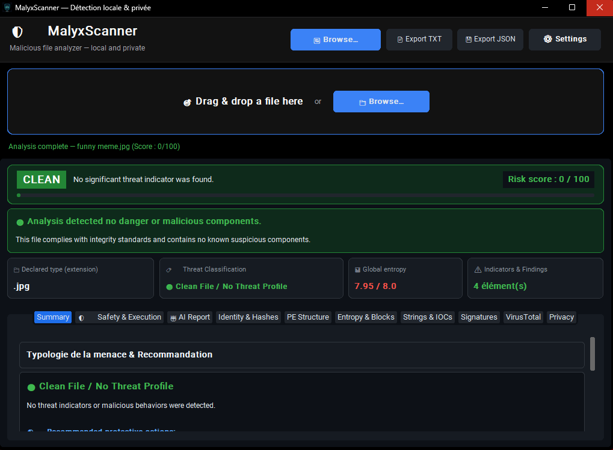
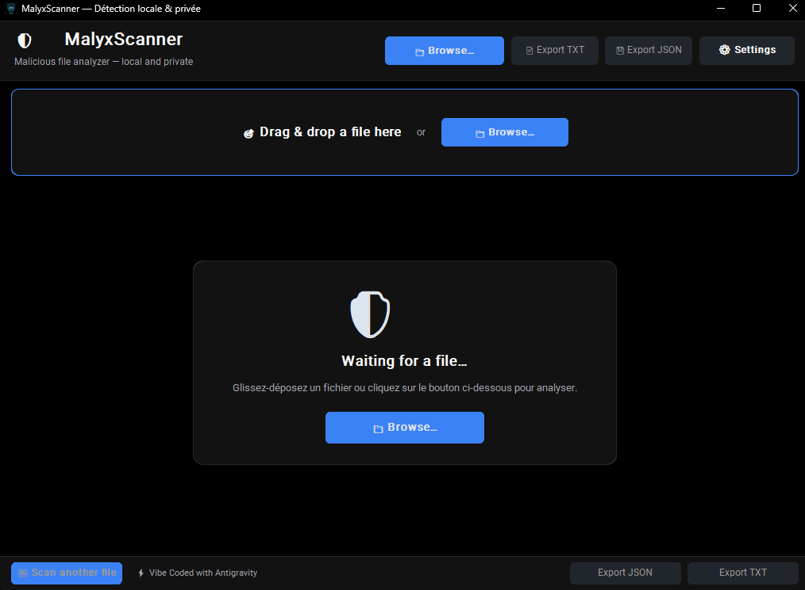

<p align="center">
  
</p>

<h1 align="center">MalyxScanner</h1>

<p align="center">
  <a href="LICENSE"></a>
  <a href="https://microsoft.com"></a>
  <a href="https://python.org"></a>
  <a href="https://github.com/maelmeriguet4-glitch/MalyxScanner/releases/tag/v2.1.3"></a>
  <a href="#privacy--offline-first-architecture"></a>
</p>

<p align="center">
  <b>High-performance offline static malware analysis engine and incident response triage desktop utility.</b>
</p>

---

## Overview

**MalyxScanner** is an open-source static malware analysis and file triage utility for Windows. It evaluates binary structure, cryptographic signatures, chunked Shannon entropy, Indicators of Compromise (IOCs), and YARA rule matches to classify potential threats without executing the target payload.

Traditional signature-based antivirus solutions often miss newly packed droppers and custom stealth payloads. MalyxScanner inspects structural indicators in depth to detect packers, anomalous write+execute memory sections, unverified binaries, and evasive behaviors.

---

## 📸 Screenshots & Live Previews

<p align="center">
  
  <br>
  <i><b>Figure 1</b>: Live malware detection (95/100 Malicious verdict) with instant Quarantine and Permanent Deletion remediation actions.</i>
</p>

<p align="center">
  
  &nbsp;
  
  <br>
  <i><b>Figure 2</b>: Clean file verification (left) and drag & drop desktop landing interface (right).</i>
</p>

---

## Technical Capabilities

### 1. Static PE & Binary Inspection
* **Authenticode Verification**: Validates WinTrust digital certificates and flags unsigned or self-signed executables.
* **Section Analysis & Anomaly Detection**: Highlights dangerous memory section permission combinations (such as `IMAGE_SCN_MEM_WRITE | IMAGE_SCN_MEM_EXECUTE`).
* **MITRE ATT&CK API Mapping**: Maps imported Windows system APIs against known malicious techniques (Process Injection, Persistence, Evasion, Token Manipulation, C2 Communications).
* **Forensic Metadata**: Extracts PDB debug paths, timestamp anomalies, compilation metadata, Subsystem, and `StringFileInfo`.

### 2. Shannon Entropy & Packer Detection
* **Global & Block-Level Entropy**: Calculates byte randomness across 16 KB chunks to pinpoint hidden, encrypted, or packed payloads within resource sections or overlay data.
* **Packing Signatures**: Recognizes UPX, VMProtect, Themida, and custom packer compression structures.

### 3. Forensic IOC & Pattern Extraction
* **Network Indicators**: Extracts public IPv4 addresses, hostnames, and suspicious protocol URLs (`http://`, `https://`, `ftp://`).
* **System Footprints**: Detects persistence registry keys (`CurrentVersion\Run`, services) and administrative commands (`powershell -enc`, `vssadmin delete shadows`, `certutil -urlcache`).
* **Universal File Support**: Analyzes 12 distinct file families (Executables, Office documents, Archives, Scripts, PDF, System binaries, Source code, Game assets, Media).

### 4. YARA Signature Matching
* Embedded standard rules for high-profile malware families, ransomware notes, and common offensive tooling.
* Extensible rule repository via custom `.yar` definitions in the `rules/` directory.

### 5. Automated Triage & Incident Remediation
* **Composite Risk Scoring (0–100)**: Evaluates structural anomalies, entropy distribution, and heuristics to assign clear verdicts (*Clean*, *Suspicious*, *Malicious*).
* **Real-Time Sentinel Background Watcher**: Passive streaming memory-bounded watcher monitoring downloads, with bottom-right high-contrast toast notifications and System Tray persistence.
* **1-Click Windows Sandbox Integration**: Dynamic `.wsb` isolated VM generation with read-only folder mounting, automatic Explorer opening, and built-in interactive activation guide.
* **Safe Quarantine Manager with XOR Obfuscation**: Neutralizes threats with byte-level XOR scrambling (blinding host AVs against false positives), paired with a dedicated GUI management panel to inspect, restore bit-for-bit, or shred quarantined items.
* **Persistent Detection History Engine**: Thread-safe, rolling 500-entry JSON detection log with instant re-scan capabilities.
* **Windows DPAPI Credential Hardening**: Encrypts all stored API keys at rest using native Windows Data Protection API (`CryptProtectData`).
* **Secure File Shredding**: Multi-pass physical data overwriting (`os.urandom` + zeroes + `fsync`) before unlinking confirmed threats.
* **Optional SOC AI Analyst (Local or Cloud)**:
  - **100% Local & Offline Mode (via [Ollama](https://ollama.com))**: Runs entirely on your CPU/GPU with models like `llama3.2`, `mistral`, or `qwen2.5`. Absolute privacy, zero API keys, and zero Internet connection required.
  - **Encrypted Cloud Mode (OpenRouter, Gemini, OpenAI, Claude)**: Fast zero-install option that transmits only a textual metadata summary over an encrypted HTTPS connection (*the actual binary file is never uploaded*).
* **Optional VirusTotal Verification**: Queries 70+ AV engines using only the file's SHA-256 hash (*the file payload itself is never transmitted*).

---

## Privacy & Offline-First Architecture

| Feature | Execution Model | Network Destination | Privacy Level |
| :--- | :--- | :--- | :--- |
| **Core Static Scanning** | 100% Local (in-memory streaming) | **None (Air-gapped)** | 🛡️ Maximum (100% Offline) |
| **Sentinel Real-Time Watcher** | 100% Local (streaming buffer) | **None** | 🛡️ Maximum (100% Offline) |
| **Windows Sandbox 1-Click** | 100% Local (Isolated Hyper-V container) | **None** | 🛡️ Maximum (100% Offline) |
| **Quarantine & File Shredding** | 100% Local (XOR obfuscation + multi-pass wipe) | **None** | 🛡️ Maximum (100% Offline) |
| **Credential Storage** | Windows DPAPI local encryption | **None** | 🛡️ Maximum (100% Offline) |
| **AI Analyst (Local - Ollama)** | 100% Local (`http://localhost:11434`) | **None (Zero Internet)** | 🛡️ Maximum (100% Offline) |
| **AI Analyst (Cloud)** | Encrypted HTTPS (Metadata summary only) | Configured LLM Endpoint | 🔒 High (File is never sent) |
| **VirusTotal Hash Lookup** | SHA-256 Hash query only | VirusTotal API | 🔒 High (File is never sent) |
| **Telemetry & Tracking** | None | **None** | 🛡️ Zero tracking / 100% Private |

---

## Installation & Usage

### Prerequisites
* Windows 10 / 11 (64-bit)
* Python 3.11+

### Quick Start
```powershell
# Clone the repository
git clone https://github.com/maelmeriguet4-glitch/MalyxScanner.git
cd MalyxScanner

# Set up virtual environment
python -m venv .venv
.\.venv\Scripts\activate

# Install dependencies
pip install -r requirements.txt

# Run MalyxScanner
python src/main.py
```

### Running Test Suite
The automated test suite verifies static parsing, entropy math, threat classification, Sentinel streaming, quarantine lifecycle, and Sandbox generation:
```powershell
python -m unittest discover -s tests
```

### Building Standalone Windows Executable
To compile an isolated standalone `.exe` using PyInstaller:
```powershell
pyinstaller --noconfirm MalyxScanner.spec
```
The compiled output is located in `dist/MalyxScanner/MalyxScanner.exe`.

---

## Project Structure

```
MalyxScanner/
├── assets/                  # Application icons and branding assets
├── rules/                   # Embedded YARA detection rules
├── src/
│   ├── core/
│   │   ├── ai_analyst.py         # AI SOC brief generator
│   │   ├── analyzer.py           # Core static analysis orchestrator
│   │   ├── entropy.py            # Shannon entropy calculation engine
│   │   ├── filetype.py           # Magic bytes and MIME detection
│   │   ├── hashes.py             # MD5, SHA-1, SHA-256, SHA-512, Imphash
│   │   ├── history.py            # Persistent detection history engine
│   │   ├── pe_analysis.py        # Windows PE header & MITRE parser
│   │   ├── remediation.py        # Safe XOR quarantine and secure deletion
│   │   ├── risk_score.py         # Heuristic composite risk scoring
│   │   ├── sandbox.py            # Windows Sandbox 1-click generator & launcher
│   │   ├── sentinel.py           # Real-time background watcher daemon
│   │   ├── strings_extractor.py  # IOC and string extraction
│   │   ├── threat_classifier.py  # Threat family taxonomy
│   │   ├── virustotal.py         # Cloud hash reputation client
│   │   └── yara_scanner.py       # YARA rule scanning engine
│   ├── gui/
│   │   ├── app.py                # Main application window & top toolbar
│   │   ├── history_panel.py      # Detection history GUI panel
│   │   ├── quarantine_panel.py   # Quarantine management GUI panel
│   │   ├── result_view.py        # Multi-tab analysis dashboard
│   │   ├── sandbox_dialog.py     # Windows Sandbox interactive activation guide
│   │   ├── settings_dialog.py    # Configuration and profile settings
│   │   ├── theme_manager.py      # Cyber dark / High contrast themes
│   │   └── toast_notification.py # Minimalist bottom-right toast alerts
│   ├── i18n/                     # Bilingual support (FR / EN)
│   └── main.py                   # Application entry point
├── tests/                        # Automated unit & integration test suite (58 tests)
└── README.md
```

---

## Contact & Feedback

* **Maintainer**: Mael Meriguet
* **Email**: [maelmeriguet4@proton.me](mailto:maelmeriguet4@proton.me?subject=[MalyxScanner]%20Inquiry%20/%20Feedback)
* **Issues**: [GitHub Issues](https://github.com/maelmeriguet4-glitch/MalyxScanner/issues)

---

## License

This project is licensed under the **MIT License** — see the [LICENSE](LICENSE) file for details.
